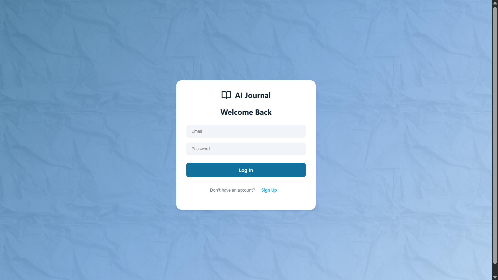
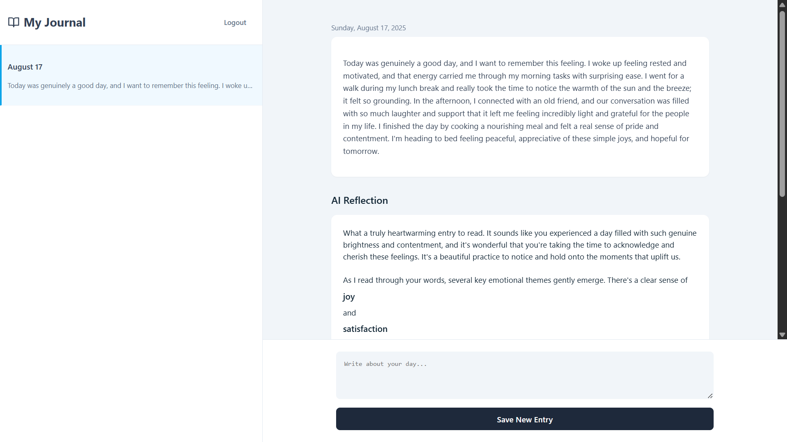
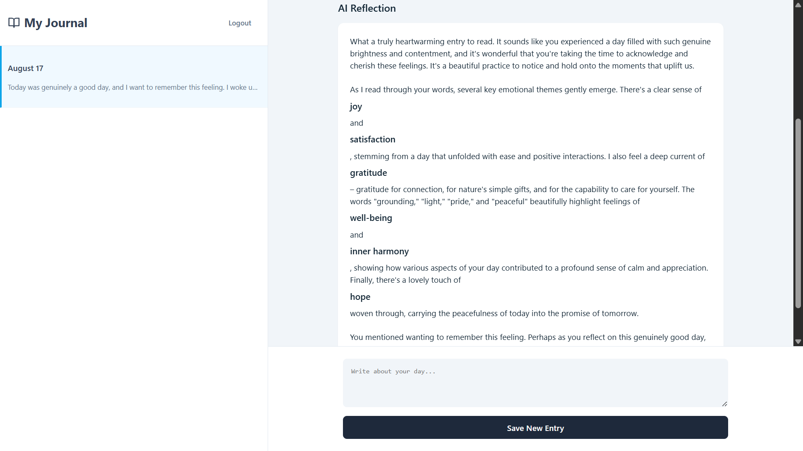

# AI-Journal-App
Transform your daily diary into an intelligent conversation with the AI-Journal-App, a modern platform designed for deeper self-discovery. This application leverages the power of Google's Gemini API to provide you with insightful prompts, instant summaries, and sentiment analysis, helping you go beyond simple note-taking. Built with a seamless React front-end and securely backed by Firebase for real-time cloud syncing, it offers a truly interactive and reflective journaling experience.

---

## Features

- 📝 **Daily Journal Entries** — Write and save your thoughts effortlessly.
- 🤖 **AI-Powered Suggestions** — Gemini API generates prompts, summaries, and reflections.
- 🎭 **Sentiment Insights** — AI detects emotional tone of your entries.
- 🔐 **Secure Authentication** — Firebase Auth for sign up and login.
- ☁️ **Cloud Storage & Sync** — Firebase Firestore keeps your entries safe and accessible.
- 📱 **Responsive Design** — Works seamlessly across desktop and mobile.

---

## 🛠️ Tech Stack

This project is built with a modern, full-stack JavaScript architecture, leveraging powerful services for the frontend, backend, and AI-powered features.

| Category       | Technology       | Description                                                                 |
|----------------|------------------|-----------------------------------------------------------------------------|
| 🎨 Frontend    | **React (Vite)** | A declarative, component-based library for building UIs.                    |
| 💅 Styling     | **Plain CSS**    | Custom styling with Flexbox and Grid for a minimalist design.               |
| ☁️ Backend     | **Firebase**     | A comprehensive platform for building web and mobile apps.                  |
| 🔐 Authentication | **Firebase Auth** | Manages secure user sign-up, login, and sessions.                          |
| 🗃️ Database    | **Firestore**    | A real-time, NoSQL cloud database for storing user data.                    |
| 🧠 AI          | **Google Gemini API** | Powers the analysis and reflection of journal entries.                     |
  

---

## Screenshots & Demo

### 🖥️ Web App Preview

  

### 📖 AI Journal Entry Example

  
  

